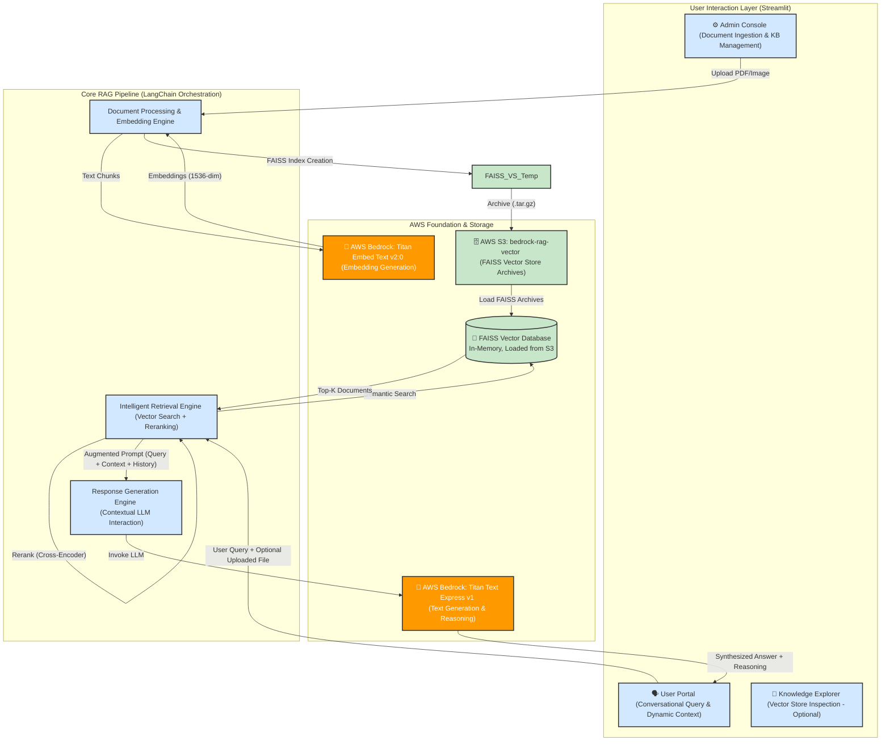
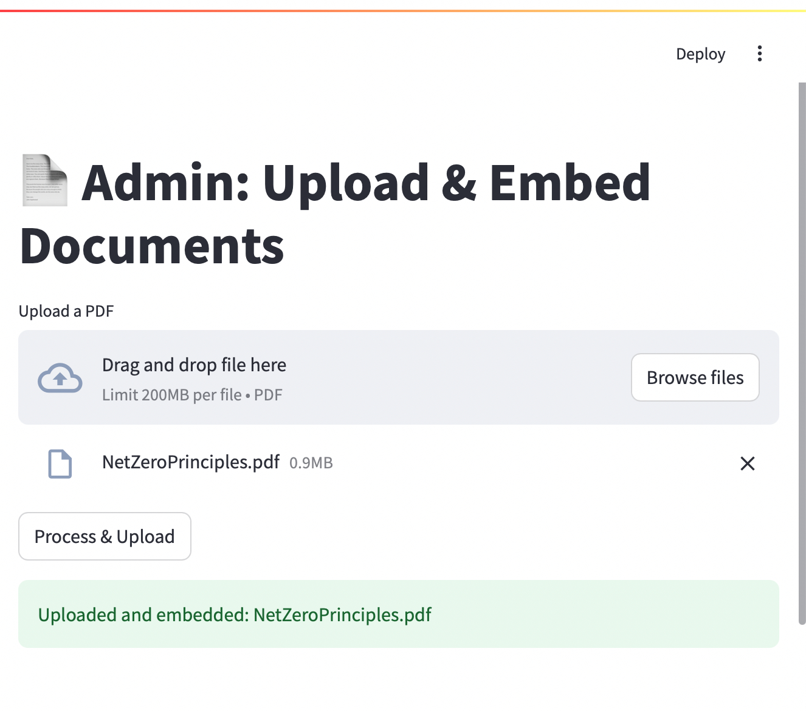
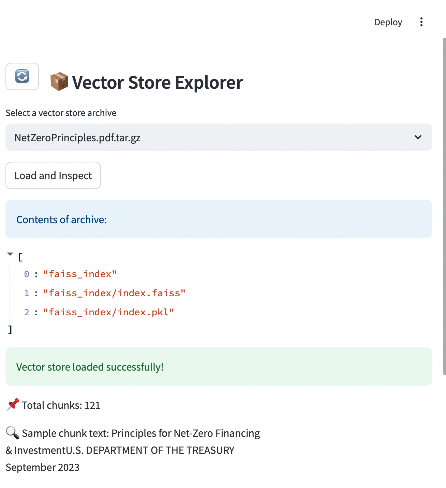
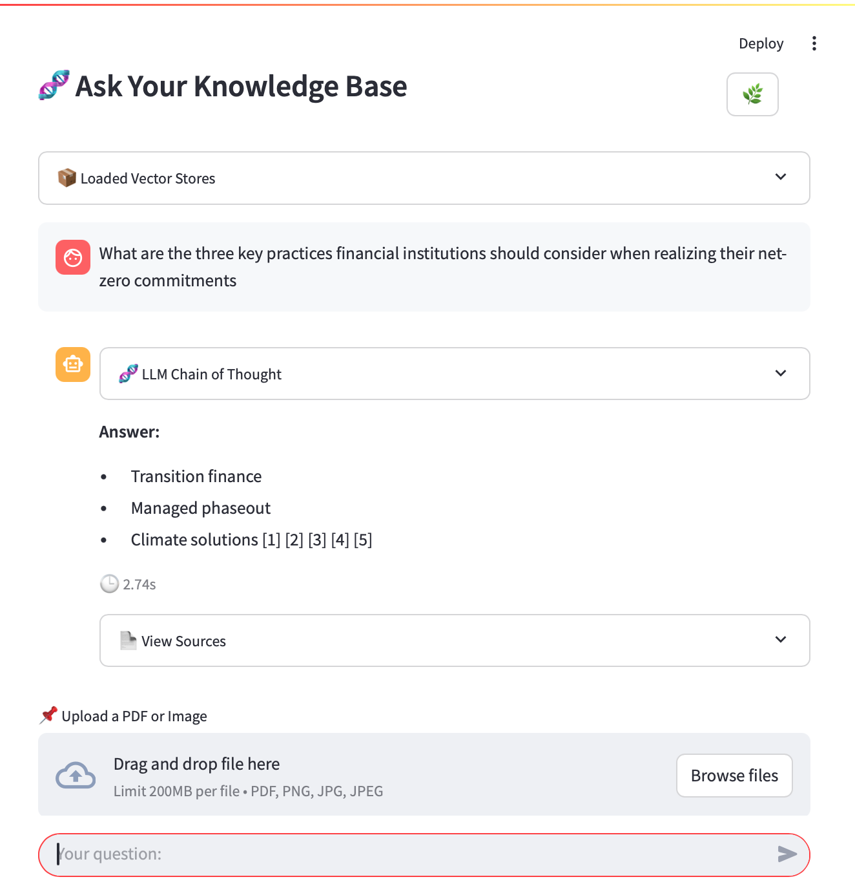

# Intelligent Document Insights with AWS Bedrock

[](https://docker.com)
[](https://aws.amazon.com/bedrock/)
[](https://aws.amazon.com/s3/)
[](https://streamlit.io)
[](https://github.com/facebookresearch/faiss)
[](https://www.langchain.com/)


Transform document repositories into a dynamic, intelligent, and conversational knowledge base using advanced AI and retrieval augmented generation (RAG).

## 🚀 Overview

The RAG Knowledge Platform transforms extensive document/ knowledge repositories into a dynamic, intelligent, and conversational knowledge base. Built on AWS Bedrock's foundation models and sophisticated vector search capabilities, it provides a secure, scalable solution for natural language querying across extensive document collections.

### Key Benefits

- **⚡ Accelerated Decision-Making** - Get immediate, contextually relevant insights from existing documents.
- **🎯 Enhanced Operational Efficiency** - Reduce information retrieval time, focus on higher-value tasks.
- **🌐 Democratized Knowledge Access** - Make complex information accessible through natural language.
- **📈 Scalable Intelligence** - Cloud-native architecture designed for scaling data and accommodating users.
- **🧠 Preserved Intellectual Knowledge** - Transform static documents into a dynamic repository of knowledge.

## 🏗️ High-Level Architecture

The platform employs a robust, multi-component architecture designed for performance, scalability, and maintainability:


## 📸 Screens

 
 


## ⚙️ System Architecture

### Document Processing Pipeline

**Ingestion & Preprocessing**
- Documents (PDFs, images) are uploaded via the Admin Console
- Text extraction using direct PDF parsing and Tesseract OCR for images
- Semantic chunking with RecursiveCharacterTextSplitter (500 chars, 50-char overlap)
- Vector embeddings generated using AWS Bedrock's `amazon.titan-embed-text-v2:0`
- FAISS vector store indexing with persistent storage in AWS S3 as compressed archives

### Query Processing & Retrieval

**Multi-Stage Retrieval System**
1. **Query Augmentation**: Optional file upload provides dynamic context during user sessions
2. **Semantic Search**: Query embeddings matched against FAISS vector store using cosine similarity
3. **Cross-Encoder Reranking**: Retrieved chunks re-scored using `cross-encoder/ms-marco-MiniLM-L-6-v2` for improved relevance precision
4. **Context Assembly**: Top-K relevant chunks combined with conversation history via `CustomChatMemory`

**Response Generation**
- Structured prompts sent to AWS Bedrock's `amazon.titan-text-express-v1`
- Temperature set to 0.1 for factual consistency
- Chain-of-thought reasoning with transparent source citations
- Confidence scoring (High/Good/Medium/Low) based on cross-encoder outputs

### Key Technical Components

- **Vector Store**: FAISS (Facebook AI Similarity Search) for efficient similarity search at scale
- **Embedding Model**: AWS Bedrock Titan for semantic representation
- **Reranking**: Cross-encoder for query-specific relevance scoring
- **LLM**: AWS Bedrock Titan Text Express for response generation
- **Storage**: AWS S3 for durable vector store persistence
- **Memory**: Contextual conversation tracking for multi-turn interactions
  
### Core Components

#### 🔄 Intelligent Document Ingestion
- **Multi-format Support**: PDFs and images (PNG, JPG, JPEG)
- **OCR Processing**: Tesseract-powered text extraction from images
- **Semantic Chunking**: Optimized text segmentation for retrieval
- **High-dimensional Embeddings**: 1536-dimension vectors via AWS Bedrock
- **Persistent Storage**: FAISS indices archived to AWS S3

#### 🔍 Advanced Query Resolution
- **Dynamic Context**: Real-time document upload during conversations
- **Two-stage Retrieval**: FAISS semantic search + Cross-Encoder reranking
- **Contextual AI**: Conversation history and context-aware responses
- **Transparent Reasoning**: Chain of Thought explanations
- **Source Citations**: Confidence-scored references to original documents

## 🛠️ Technology Stack

### AI/ML Services
- **AWS Bedrock**
  - Embedding: `amazon.titan-embed-text-v2:0` 
  - Language Model: `amazon.titan-text-express-v1`
- **Vector Database**: FAISS (Facebook AI Similarity Search)
- **Reranking**: [cross-encoder/ms-marco-MiniLM-L-6-v2](https://huggingface.co/cross-encoder/ms-marco-MiniLM-L6-v2)
- **Orchestration**: LangChain

### Application Stack
- **Frontend**: Streamlit (Multi-app architecture)
- **Storage**: AWS S3
- **Document Processing**: PyPDF2, Pillow, Tesseract OCR
- **Runtime**: Python 3.11
- **Deployment**: Docker & Docker Compose
- **AWS SDK**: Boto3

## 🚀 Quick Start

### Prerequisites
- AWS Account with Bedrock access
- Docker and Docker Compose
- Python 3.11+

### Installation

1. **Clone the repository**
   ```bash
   git clone https://github.com/sarkarj/Intelligent-Document-Insights-with-AWS-Bedrock.git
   cd Intelligent-Document-Insights-with-AWS-Bedrock
   ```

2. **Configure AWS settings**
   ```yaml
    AWS_ACCESS_KEY_ID=<access_key>
    AWS_SECRET_ACCESS_KEY=<secret_key>
    AWS_REGION=<aws_region>
    BEDROCK_MODEL_ID=amazon.titan-embed-text-v2:0
    BEDROCK_LLM_ID=amazon.titan-text-express-v1
    EMBEDDING_BUCKET=<aws_s3_bucket>
   ```

3. **🐳 Deploy with Docker Compose**
   ```bash
   docker-compose up -d
   ```

### Usage

1. **Admin Console** - Upload and manage documents
   - Access: `http://localhost:8501`
   - Upload PDFs or images
   - Monitor knowledge base status

2. **User Portal** - Query your knowledge base
   - Access: `http://localhost:8502`
   - Ask natural language questions
   - Upload contextual documents during conversations

3. **Knowledge Explorer** (Optional) - Inspect vector stores
   - Access: `http://localhost:8503`
   - Explore document embeddings and metadata

## 🔧 Configuration

### Model Parameters
```python
# LLM Configuration
temperature: 0.1  # For factual responses
max_tokens: 2000
search_kwargs={"k": 10} # Return the top 10 most similar documents
```
```
MAX_CITATIONS = 5  # Maximum number of citations to show
MIN_CONFIDENCE_THRESHOLD = 0.1  # Minimum confidence score for citations
CHAIN_OF_THOUGHT_STEPS = 4  # Number of reasoning steps to show
```

## 🔐 Security & Enterprise Features

### Security
- **Data Encryption**: AWS S3 server-side encryption (data at rest) + HTTPS (data in transit)
- **Access Control**: AWS IAM roles and policies
- **Container Security**: Non-root user execution
- **Environment Management**: Secure credential injection

### Scalability
- **Stateless Applications**: Horizontal scaling ready
- **Managed AI Backend**: Auto-scaling AWS Bedrock
- **Unlimited Storage**: AWS S3 scalability
- **Optimized Search**: High-performance FAISS indexing

### Extensibility
- **Modular Architecture**: LangChain component swapping
- **API Integration**: Ready for system integration
- **Custom Data Sources**: Extensible ingestion pipeline
- **Multi-format Support**: Expandable document processing

## 📊 Key Features

### 🔄 Hybrid RAG with Dynamic Context
- Pre-indexed enterprise knowledge
- Real-time document injection during conversations
- Session-specific context augmentation

### 🎯 Sophisticated Relevance Engine
- Two-stage retrieval process
- FAISS semantic search
- Cross-Encoder reranking for precision

### 🔍 Transparent & Explainable AI
- Chain of Thought reasoning
- Source citations with confidence scores
- AI decision-making transparency

### 💬 Context-Aware Conversations
- Dialogue history maintenance
- Natural follow-up questions
- Contextual understanding


## 📈 Business Impact

- **Drastic Reduction** in information retrieval time
- **Improved Accuracy** of information-based decisions
- **Enhanced Productivity** across all levels
- **Faster Onboarding** for new members
- **Innovation Catalyst** through accessible knowledge


## 📄 License

This project is licensed under the MIT License - see the [LICENSE](LICENSE.txt) file for details.


---

**🤝 Transforming knowledge into conversational intelligence.**

[]() []()


